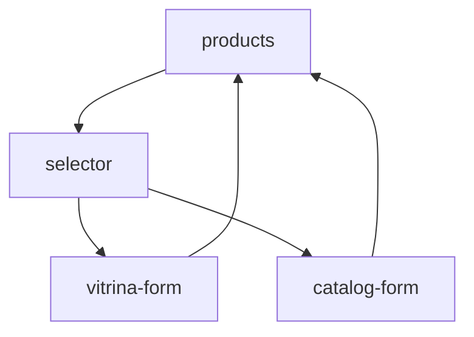
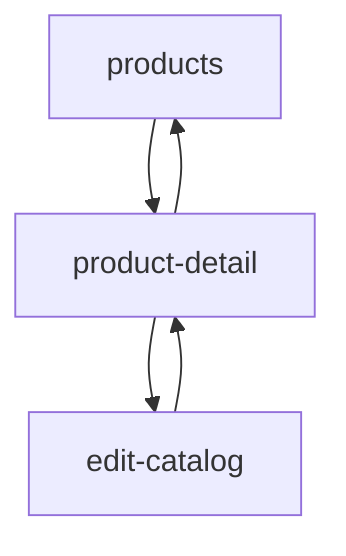
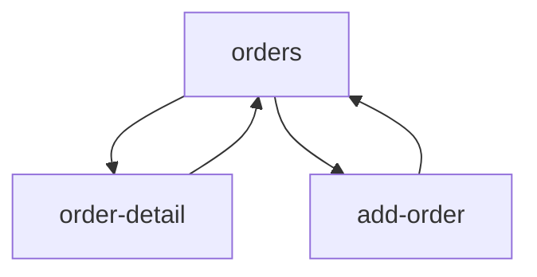
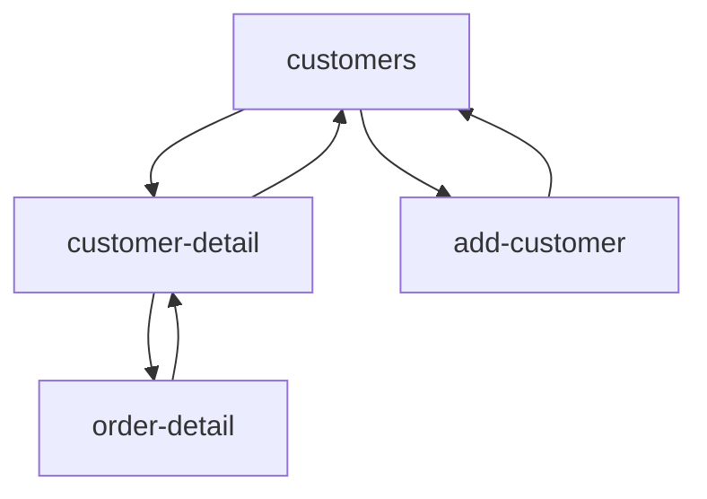
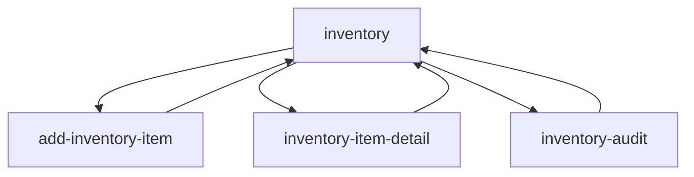
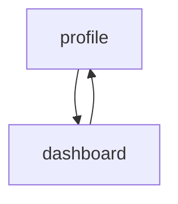

# 🗺️ Навигационная карта приложения

## 📊 Обзор навигации

Приложение использует **centralized state-based routing** через `useAppState` hook с поддержкой URL state для фильтров и поиска.

## 🏗️ Архитектура роутинга

### Основная структура
```typescript
// App.tsx - центральный роутер
switch (state.currentScreen) {
  case 'products': return <MainTabView />; 
  case 'product-detail': return <AppWrapper><ProductDetail /></AppWrapper>;
  case 'vitrina-form': return <AppWrapper><AddProductForm /></AppWrapper>;
  // ...
}
```

### State-based Navigation
```typescript
// Навигация через actions
const actions = useAppActions(state);

actions.handleViewProduct(productId);     // → product-detail
actions.handleAddProduct();               // → selector  
actions.handleCloseToList();             // ← назад к списку
```

## 📱 Главные вкладки (MainTabView)

### 1. 🛍️ Products (`products`)
**Путь:** `activeTab: 'products'` + `currentScreen: 'products'`

**Функции:**
- Список товаров (витрина/каталог)
- Поиск и фильтрация
- Переключение статуса товаров
- Quick actions (добавить, просмотреть)

**URL State:**
```
?filter=vitrina|catalog    # Фильтр типа товара
?search=query             # Поисковый запрос
```

### 2. 📦 Orders (`orders`)  
**Путь:** `activeTab: 'orders'` + `currentScreen: 'orders'`

**Функции:**
- Лента заказов
- Фильтрация по статусам
- Изменение статусов
- Создание заказов

### 3. 📊 Inventory (`inventory`)
**Путь:** `activeTab: 'inventory'` + `currentScreen: 'inventory'`

**Функции:**
- Складские остатки
- Поставки товаров
- Инвентаризация
- Аналитика движения

### 4. 👥 Customers (`customers`)
**Путь:** `activeTab: 'customers'` + `currentScreen: 'customers'`

**Функции:**
- База клиентов
- Поиск клиентов
- Статистика по клиентам
- Privacy-first подход

### 5. ⚙️ Profile (`profile`)
**Путь:** `activeTab: 'profile'` + `currentScreen: 'profile'`

**Функции:**
- Настройки магазина
- Аналитика и отчеты
- Управление пользователями

## 🧩 Детальные экраны

### 🛍️ Товары (Products Flow)

#### Product Creation Flow


**Экраны:**
- `selector` - Выбор типа товара (Витрина/Каталог)
- `vitrina-form` - Простая форма (фото + цена)
- `catalog-form` - Расширенная форма (видео, состав, цвета)

#### Product Management Flow


**Экраны:**
- `product-detail` - Детальный просмотр товара
- `edit-catalog` - Редактирование каталожного товара

### 📦 Заказы (Orders Flow)

#### Order Management Flow  


**Экраны:**
- `order-detail` - Детали заказа с возможностью редактирования
- `add-order` - Создание нового заказа

### 👥 Клиенты (Customers Flow)

#### Customer Management Flow


**Экраны:**
- `customer-detail` - Профиль клиента + история заказов
- `add-customer` - Добавление нового клиента

### 📊 Склад (Inventory Flow)

#### Inventory Management Flow


**Экраны:**
- `add-inventory-item` - Добавление поставки
- `inventory-item-detail` - Детали товара на складе
- `inventory-audit` - Проведение инвентаризации

### ⚙️ Профиль (Profile Flow)

#### Analytics Flow


**Экраны:**
- `dashboard` - Аналитика и отчеты

## 🎯 Navigation Patterns

### AppWrapper Pattern
```typescript
// Все детальные экраны используют AppWrapper
case 'product-detail':
  return (
    <AppWrapper {...wrapperProps}>
      <ProductDetail />
    </AppWrapper>
  );
```

**Преимущества:**
- ✅ Единообразный layout
- ✅ Централизованное управление навигацией
- ✅ Автоматическая активная вкладка
- ✅ Toaster интеграция

### Tab Auto-Detection
```typescript
// Автоматическое определение активной вкладки
const getActiveTabForScreen = (screen: Screen) => {
  switch (screen) {
    case 'product-detail':
    case 'vitrina-form':
    case 'catalog-form':
      return 'products';
    case 'order-detail':
    case 'add-order':
      return 'orders';
    // ...
  }
};
```

### Back Navigation
```typescript
// Универсальная навигация назад
const handleCloseToList = () => {
  // Возвращает к соответствующему списку
  switch (currentScreen) {
    case 'product-detail':
    case 'vitrina-form':
    case 'catalog-form':
      navigateToScreen('products');
      break;
    // ...
  }
};
```

## 🔗 URL State Management

### Supported URL Parameters
```typescript
interface URLParams {
  filter?: 'vitrina' | 'catalog';  // Фильтр товаров
  search?: string;                 // Поисковый запрос
  tab?: string;                    // Активная вкладка (persistence)
}
```

### URL Utilities
```typescript
// urlManager для работы с URL
import { urlManager } from './src/utils/url';

// Установка фильтра товаров
urlManager.setProductsFilter('vitrina');

// Установка поискового запроса  
urlManager.setProductsSearch('roses');

// Получение параметров
const params = urlManager.getParams();
// { filter: 'vitrina', search: 'roses' }
```

### Browser History Support
```typescript
// Поддержка кнопки "Назад" браузера
useEffect(() => {
  const handlePopState = () => {
    const params = urlManager.getParams();
    setFilter(params.filter || 'vitrina');
    setSearchQuery(params.search || '');
  };

  window.addEventListener('popstate', handlePopState);
  return () => window.removeEventListener('popstate', handlePopState);
}, []);
```

## 📱 Mobile vs Desktop Navigation

### Mobile Navigation
- **Bottom Tab Bar** для основных вкладок
- **Header actions** для быстрых действий
- **Stack navigation** для детальных экранов
- **Swipe gestures** (планируется)

### Desktop Navigation  
- **Sidebar navigation** с иконками и лейблами
- **Breadcrumbs** для deep navigation
- **Keyboard shortcuts** (планируется)
- **Multiple tabs** support (планируется)

## 🎛️ Navigation State

### Current State Shape
```typescript
interface NavigationState {
  currentScreen: Screen;           // Текущий экран
  activeTab: Tab;                  // Активная вкладка
  selectedProductId: number | null;
  selectedOrderId: string | null;
  selectedCustomerId: number | null;
  selectedInventoryItemId: number | null;
}
```

### Navigation Actions
```typescript
interface NavigationActions {
  // Основная навигация
  navigateToScreen: (screen: Screen) => void;
  navigateBack: () => void;
  setActiveTab: (tab: Tab) => void;
  
  // Выбор элементов для детального просмотра
  setSelectedProductId: (id: number | null) => void;
  setSelectedOrderId: (id: string | null) => void;
  setSelectedCustomerId: (id: number | null) => void;
  
  // Высокоуровневые действия
  handleViewProduct: (id: number) => void;
  handleAddProduct: () => void;
  handleCloseToList: () => void;
}
```

## 🚀 Доменные экраны в деталях

### 🛍️ Products Screens

#### **ProductsList** - Основной список товаров
```typescript
// Desktop: Table view с bulk actions
// Mobile: Cards с быстрыми действиями
// URL State: ?filter=vitrina&search=roses
```

#### **ProductTypeSelector** - Выбор типа
```typescript
// Modal/fullscreen выбор между витриной и каталогом
// Описание различий для пользователя
```

#### **AddProductForm / AddCatalogForm** - Создание товаров  
```typescript
// Витрина: простая форма (фото + цена + размеры)
// Каталог: расширенная (видео + состав + цвета + время)
```

#### **ProductDetail** - Детали товара
```typescript
// Desktop: Side-by-side медиа + информация
// Mobile: Вертикальный стек
// Actions: редактировать, изменить статус
```

### 📦 Orders Screens

#### **Orders** - Лента заказов
```typescript
// Статусы: new → paid → accepted → assembled → in-transit → completed
// Фильтрация по статусам с цветовым кодированием
// Quick status updates
```

#### **OrderDetail** - Детали заказа (✨ РЕФАКТОРЕН)
```typescript
// 🏗️ Модульная архитектура в /components/orders/:
// 
// OrderDetail.tsx - основной контейнер (БЕЗ AppWrapper)
// ├── OrderHeader.tsx - мобильный/десктоп хедер с кнопками
// ├── OrderContent.tsx - responsive контент
// │   ├── OrderItems.tsx - товары заказа с ImageWithFallback
// │   └── OrderInfo.tsx - редактируемая информация
// └── StatusPanel.tsx - управление статусом (только desktop)
//     ├── OrderHistory.tsx - timeline с иконками событий
//     └── ShareMenu.tsx - меню поделиться с копированием

// 📱 Mobile Layout:
// - Fixed header (16px height) с кнопкой назад + статус badge
// - Вертикальный стек контента
// - Bottom padding для FAB

// 🖥️ Desktop Layout:  
// - Split view: 60% контент + 40% статус панель
// - Sidebar с историей и управлением
// - Card-based информация

// 🎯 Функции:
// - Inline редактирование всех полей заказа
// - Реальная интеграция с useAppState (Supabase)
// - Timeline история с относительным временем
// - Меню поделиться (ссылки для коллег/клиентов, PDF)
// - Управление статусом, флористом, курьером
// - Уведомления о замене цветов
// - Добавление фото до доставки
```

#### **AddOrder** - Создание заказа
```typescript
// Multi-step: клиент → товары → доставка → подтверждение
// Интеграция с каталогом товаров
// Автоматический расчет стоимости
```

### 👥 Customers Screens

#### **Customers** - База клиентов
```typescript
// Privacy-first: только имя + телефон
// Статусы: active | vip | inactive
// Поиск по имени и телефону
```

#### **CustomerDetail** - Профиль клиента
```typescript
// Desktop: Grid (информация + история заказов)
// Статистика: заказов, потрачено, средний чек
// Заметки с inline редактированием
```

#### **AddCustomer** - Добавление клиента
```typescript
// Минимальная форма: имя (опционально) + телефон (обязательно)
// Privacy information card
// Автоформатирование телефона
```

### 📊 Inventory Screens

#### **Inventory** - Складские остатки
```typescript
// Категоризация: цветы, зелень, аксессуары
// Уведомления о низких остатках
// Массовые операции
```

#### **AddInventoryItem** - Поставки
```typescript
// Batch добавление товаров
// Автоподсказки существующих товаров
// Tracking серий поставок
```

#### **InventoryAudit** - Инвентаризация
```typescript
// Пошаговый процесс подсчета
// Сравнение с системными данными
// Автокоррекция расхождений
```

## 🧪 Testing Navigation

### Navigation Testing Patterns
```typescript
// Тестирование переходов между экранами
test('should navigate to product detail', () => {
  const { result } = renderHook(() => useAppActions());
  
  act(() => {
    result.current.handleViewProduct(1);
  });
  
  expect(result.current.currentScreen).toBe('product-detail');
  expect(result.current.selectedProductId).toBe(1);
});

// Тестирование URL state
test('should update URL when filtering products', () => {
  render(<ProductsList />);
  
  fireEvent.click(screen.getByText('Каталог'));
  
  expect(window.location.search).toContain('filter=catalog');
});
```

## 🚀 Future Navigation Enhancements

### Planned Features
- **Deep linking** - прямые ссылки на товары/заказы
- **Breadcrumb navigation** для desktop
- **Keyboard shortcuts** для power users  
- **Swipe navigation** на мобильных
- **Multiple tabs** support на desktop
- **Navigation history** с undo/redo

### Performance Optimizations
- **Route-based code splitting**
- **Preloading** для частых переходов
- **State persistence** для offline работы
- **Navigation caching** для быстрых переходов

---

**Эта навигационная система обеспечивает intuitive и эффективное перемещение по всем функциям приложения. 🗺️**