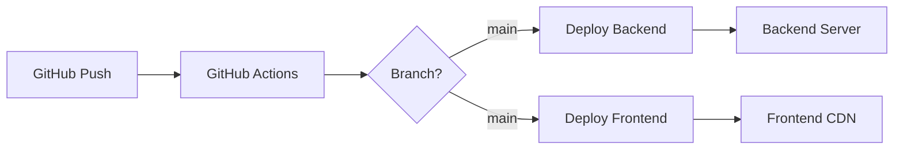

# CRM Florists - Структура проекта

## Текущая архитектура (Рекомендуемая) ✅

```
~/Downloads/
├── CRM for florists10/     # Frontend (React + TypeScript)
│   ├── src/
│   ├── package.json
│   └── docker-compose.yml   # Для локальной разработки
│
└── Leken/                   # Backend (FastAPI + Python)
    ├── crm_api.py
    ├── main_sqlmodel.py
    └── requirements.txt
```

### Преимущества раздельных репозиториев:
- ✅ Чистое разделение ответственности
- ✅ Независимый деплоймент
- ✅ Разные CI/CD пайплайны
- ✅ Оптимальные настройки для каждой технологии
- ✅ Проще масштабировать команду

## Альтернатива 1: Git Submodules

```bash
# В репозитории frontend добавить backend как submodule
cd "CRM for florists10"
git submodule add https://github.com/alekenov/leken-auth-system.git backend
git submodule update --init --recursive
```

Структура:
```
CRM for florists10/
├── src/              # Frontend код
├── backend/          # Submodule с backend
└── package.json
```

## Альтернатива 2: Монорепозиторий

```
crm-florists-full/
├── frontend/
│   ├── src/
│   └── package.json
├── backend/
│   ├── crm_api.py
│   └── requirements.txt
├── docker-compose.yml
└── README.md
```

### Недостатки монорепозитория:
- ❌ Смешивание Python и JavaScript зависимостей
- ❌ Сложнее с GitHub Actions
- ❌ Больше конфликтов при мерже
- ❌ Один большой Docker образ вместо двух оптимизированных

## Рекомендация 🎯

**Оставить репозитории раздельными**, но использовать:

1. **Docker Compose** для локальной разработки
2. **Shared API specs** (OpenAPI/Swagger) для синхронизации
3. **GitHub Actions** для автоматического тестирования совместимости

### Запуск локально:

```bash
# Вариант 1: Shell script
chmod +x dev.sh
./dev.sh start

# Вариант 2: Docker Compose
docker-compose up

# Вариант 3: Вручную в двух терминалах
# Terminal 1:
cd ../Leken && python3 -m fastapi dev main_sqlmodel.py --port 8011

# Terminal 2:
cd "CRM for florists10" && npm run dev
```

## API Contract Sync

Создать файл `api-contract.yml` который используют оба проекта:

```yaml
# shared/api-contract.yml
openapi: 3.0.0
info:
  title: CRM Florists API
  version: 1.0.0
paths:
  /orders:
    # ... описание endpoints
```

## Deployment Strategy



## Выводы

Для вашего проекта лучше **сохранить раздельные репозитории**, потому что:
1. У вас уже настроена работающая система
2. Backend и Frontend используют разные технологии
3. Легче управлять правами доступа
4. Проще деплоить независимо

При этом удобство разработки обеспечивается через Docker Compose или shell скрипты.